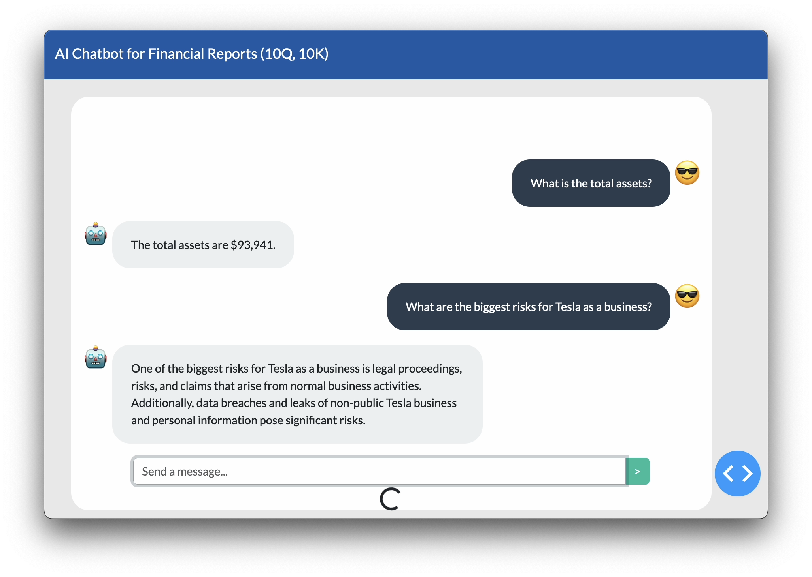

# RAG Chatbot for Financial Document (10Q, 10K) Summarization)

Check [github.com/kHarshit/Financial_Document_Summarization_through_RAG](https://github.com/kHarshit/Financial_Document_Summarization_through_RAG)

Developed Chatbot leveraging Retrieval Augmented Generation (RAG) with GPT, LLama 2, Gemma models to extract, summarize key performance indicators (KPIs) from 10-Q financial docs with LangChain, HuggingFace for LLM, Chroma for vector databases

