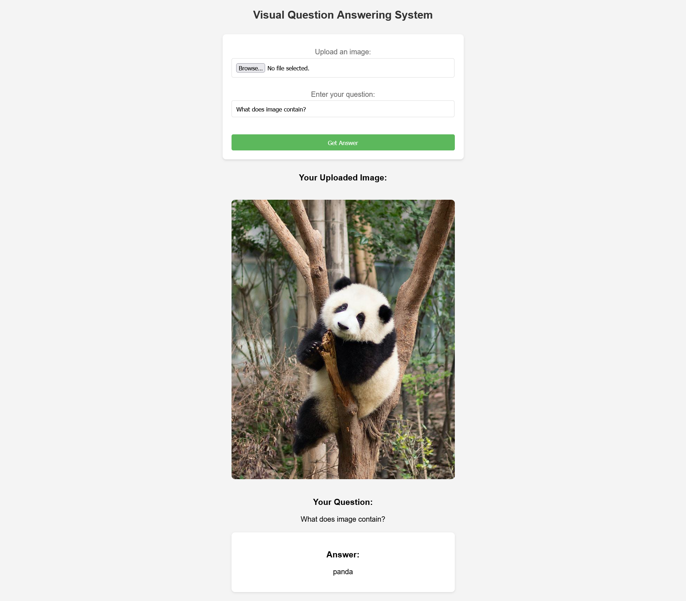

# Visual Question Answering with Generative AI

Check [github.com/kHarshit/visual-question-answering](https://github.com/kHarshit/visual-question-answering)

Integrated Hugging Face pre-trained tokenizers, Vision Transformer (ViT) for images, and LLMs for generating answers.

Achieved 0.3 WUPS with RoBERTa and BEiT outperforming all 4 model combinations viz. ViT, DEiT with BERT, GPT.

