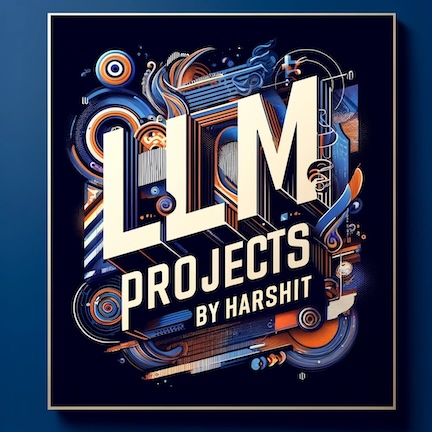

# Large Language Models (LLMs) Projects 

  
Generated by DALL·E

## DS5983 Projects

These projects are part of DS5983 Special Topics in Data Science - LLMs at Khoury Collge, Northeastern University.

* **Project 1 (N-gram models):** 
    * Test various n-gram models on Reuters.
* **Project 2 (Transformer Architecture Implementation and Machine Translation):** 
    * Implemented Transformer model architecture form scratch. Train the model on a machine translation task from German to English using the Multi30k dataset. 
    * Implemented greedy decoding and beam search for translation.
* **Project 3 (Text Summarization with HuggingFace BART):**     
    * Evaluated summarization of 3 pre-trained Hugging Face Transformer models BART, T5, Pegasus on SAMSum dataset. 
    * Improved BART model’s ROUGE score on testing set from 28.7 to 37.5 by fine-tuning with Mixed Precision (AMP).
* **Project 4 (Prompt Engineering and Few-Shot Learning with Flan-T5 for Dialogue Summarization):** 
    * Performed prompt engineering on Flan-T5 using dialogsum dataset with instructional prompts and pre-built T5 prompts. 
    * Experimented with zero-shot and few-shot learning to assess their impact on summaries' relevance and coherence.
* **Project 5 (Fine-Tuning Flan-T5 with PEFT (LoRA)):**        
    * Fine-tuned Flan-T5 LLM for dialogue summarization, employing full and parameter-efficient techniques (PEFT), achieving enhanced performance metrics evaluated via ROUGE scores. 
    * Applied Low-Rank Adaptation (LoRA) to optimize training efficiency, reducing computational resources while maintaining high accuracy in AI-driven summarization tasks.
* **Final Project (Chatbot leveraging RAG for Financial Document (10Q, 10K) Summarization)**: Check [github.com/kHarshit/Financial_Document_Summarization_through_RAG](https://github.com/kHarshit/Financial_Document_Summarization_through_RAG)
     * Developed Chatbot leveraging Retrieval Augmented Generation (RAG) with GPT, LLama 2, Gemma models to extract, summarize key performance indicators (KPIs) from 10-Q financial docs with LangChain, HuggingFace for LLM, Chroma for vector databases

## Other Projects

* **Visual Question Answering with Generative AI**: Check [github.com/kHarshit/visual-question-answering](https://github.com/kHarshit/visual-question-answering)
    * Integrated Hugging Face pre-trained tokenizers, Vision Transformer (ViT) for images, and LLMs for generating answers.
    * Achieved 0.3 WUPS with RoBERTa and BEiT outperforming all 4 model combinations viz. ViT, DEiT with BERT, GPT.
